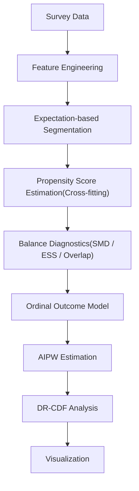

# Ordinal Causal Segmentation

因果推論と順序データ解析を組み合わせ、
利用者セグメントごとの施策効果を推定する分析パイプラインです。

## このプロジェクトで実装したこと

- Propensity Score
- Cross-fitting
- AIPW
- DR-CDF
- Ordinal Classification
- Segment Optimization

Pythonで一連の分析パイプラインを実装しました。

## 使用技術

Python

pandas

NumPy

scikit-learn

matplotlib

# 背景
企業では、マーケティング施策やサービス改善の意思決定のために、アンケートや顧客満足度データが広く活用されています。特に、満足度や推薦意向のような 5段階評価（順序カテゴリデータ） は、サービス品質を評価する重要な指標です。

しかし、従来の分析では平均値や単純な相関分析が中心であり、

- どの評価項目が推薦意向に影響しているのか
- その関係が因果的なものなのか
- どのような利用者に効果が大きいのか

を十分に把握することは困難です。

さらに、同じ満足度であっても、利用者の期待や属性によって推薦意向への影響は異なる可能性があります。そのため、平均的な分析結果だけでは、利用者ごとに最適な改善施策を検討することは難しいという課題があります。# -

# 目的

本プロジェクトでは、賃貸情報サイトにおける物件情報の質がユーザーの推薦意向へ与える影響を、観察データから因果推論によって推定することです。

具体的には、

- Propensity Scoreによる交絡調整
- AIPWによる平均処置効果（ATE）の推定
- DR-CDFによる分布全体の効果分析
- 期待度セグメントごとの効果比較

を実装し、

利用者層ごとに優先して改善すべき情報品質を明らかにすることを目指しました。

本プロジェクトでは、賃貸情報サイトのアンケートデータを対象に、

- 因果推論による交絡の補正
- 順序カテゴリデータに対応したアウトカムモデリング
- 利用者の期待度に基づくセグメント分析

を組み合わせることで、

「どの情報品質を改善すると推薦意向が高まるのか」

を利用者層ごとに推定できる分析パイプラインを実装しました。

さらに、平均的な効果だけでなく、推薦意向の分布全体の変化を分析することで、利用者層ごとの反応の違いも可視化しました。

# フロー図

# Step1 セグメント設計

利用者全体を平均で評価するのではなく、
期待度の異なる利用者層ごとに施策効果を比較する。

### 実装内容

期待度スコアから

Low
Middle
High

の3セグメントを生成。

単純な分位点分割ではなく、

##### 設計診断指標

SMD
,ESS
,Overlap

を用いて因果推定しやすい境界を探索。

### 実装した関数
rank_cuts_design_optimal()

### 工夫点

結果変数（推薦意向）を見ずに境界を決定することで、
データリークを防止。

# Step2 Propensity Score
交絡の補正を行う。

### 実装内容
Logistic Regression
,Cross-fitting
,Probability Calibration

### 工夫点
Out-of-fold predictionを用いて推定バイアスを抑制。

### 実装した関数
fit_ps_oof()
Step3 Balance Diagnostics
目的

処置群と対照群が比較可能か確認する。

### 評価指標

SMD
,ESS
,Overlap
### 実装した関数
weighted_smd()
weighted_smd_detail()
# Step4 Outcome Model
推薦意向は

1,2,3,4,5

という順序データである。

通常の分類器では1と5を同じ距離として扱う。
そこで
Ordinal Classification
を利用し、順序情報を保持した確率予測を実装。

### 実装した関数
fit_cf_oc()
# Step5 AIPW

平均処置効果（ATE）の推定。

### 特徴
Double Robust
,Cross-fitting
,Influence Function
### 実装した関数
oc_aipw_ate()
# Step6 DR-CDF
平均値だけでは分からない推薦意向の分布変化を評価。

例えば平均は同じでも

Before
1 2 3 4 5

↓

After
1 1 2 5 5

では意味が違います。

DR-CDFでは

この変化を評価できます。

### 実装した関数
oc_dr_cdf_by_seg()
# Step7 可視化

ATE
,DR-CDF
,Influence Function
,SMD

を可視化。

# 結果
### セグメント評価

###### 正確性
| Segment | Treated ($n_1$) | Control ($n_0$) | Max SMD ↓ | Extreme PS Rate ↓ | ESS Ratio ↑ |
|:-------:|----------------:|----------------:|----------:|------------------:|------------:|
| 0 | 14 | 244 | 0.586 | 0.000 | 0.993 |
| 1 | 270 | 642 | 0.153 | 0.000 | 0.995 |
| 2 | 124 | 31 | 0.358 | 0.000 | 0.994 |

