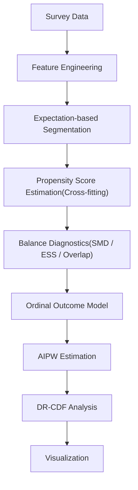

# 顧客アンケートから「どの施策を優先すべきか」を因果推論で可視化(Ordinal Causal Segmentation)

顧客アンケートの順序データ（5段階評価）を対象に、
因果推論を用いて施策効果をセグメントごとに推定する分析パイプラインです。

AIPW・Cross-fitting・DR-CDFを実装し、
平均効果だけでなく分布全体の変化まで評価できます。

## この分析で分かること

- どの施策が最も効果的か
- どの利用者層に効果があるか
- 平均値だけでは分からない評価分布の変化
- 因果推論による比較可能なセグメント設計

例えば、

「情報量を改善すると推薦意向は向上するのか？」

「期待度が高い利用者ほど更新頻度は重要なのか？」

といった施策効果を観察データから推定できます。

## 主な分析結果

- 情報量（豊富さ）は全セグメントで最も大きな因果効果を示した
- 高期待層では更新頻度改善による効果が大きかった
- 低期待層では情報量改善により低評価の割合が減少した

### ATE
ATEを用いて、各情報品質項目が推薦意向に与える平均的な因果効果を推定しました。

### DR-CDF

平均値だけでは把握できない変化を確認するため、DR-CDFを用いて推薦意向の分布全体を比較しました。

### HEI

 フロー図

## 使用技術

Python

- pandas
- NumPy
- scikit-learn
- matplotlib

実装

- Propensity Score
- Cross-fitting
- AIPW
- DR-CDF
- Ordinal Classification
- Segment Optimization

対象データ
-オリコンデータセット「賃貸情報サイト」に関するアンケート

目的
-施策効果を因果推論で推定

成果
-利用者層ごとの優先施策を可視化

## 工夫した点

### ① データリーク防止

結果変数を利用せず、
SMD・ESS・Overlapのみで
セグメント境界を探索。

---

### ② Cross-fitting

Out-of-fold predictionを利用し、
Propensity Score推定のバイアスを抑制。

---

### ③ Double Robust

AIPWを採用することで、
モデルの一部が誤指定でも
推定の頑健性を確保。

---

### ④ 順序データ対応

推薦意向をOrdinal Classificationで学習し、
順序情報を保持した推定を実装。

---

### ⑤ 平均だけでなく分布も評価

ATEだけでなく
DR-CDFにより評価分布全体の変化を分析。

## Notebook構成

1. Data Loading
2. Feature Engineering
3. Segment Optimization
4. Propensity Score
5. Balance Diagnostics
6. Outcome Model
7. AIPW
8. DR-CDF
9. Visualization

主要関数

rank_cuts_design_optimal()

fit_ps_oof()

weighted_smd()

fit_cf_oc()

oc_aipw_ate()

oc_dr_cdf_by_seg()

## 結果
### セグメント評価

提案手法では、期待度のセグメント境界を設計診断指標に基づいて最適化し、各セグメント内で処置群と対照群を比較しやすいデータ構造を構築しました。

分析結果は以下の通りです。

##### 正確性
| Segment | Treated ($n_1$) | Control ($n_0$) | Max SMD ↓ | Extreme PS Rate ↓ | ESS Ratio ↑ |
|:-------:|----------------:|----------------:|----------:|------------------:|------------:|
| 0 | 39 | 502 | 0.276 | 0.218 | 0.683 |
| 1 | 84 | 257 | 0.377 | 0.012 | 0.228 |
| 2 | 285 | 158 | 0.086 | 0.002 | 0.744 |

##### 更新頻度
| Segment | Treated ($n_1$) | Control ($n_0$) | Max SMD ↓ | Extreme PS Rate ↓ | ESS Ratio ↑ |
|:-------:|----------------:|----------------:|----------:|------------------:|------------:|
| 0 | 51 | 490 | 0.129 | 0.100 | 0.784 |
| 1 | 101 | 240 | 0.065 | 0.000 | 0.937 |
| 2 | 307 | 136 | 0.110 | 0.002 | 0.870 |

##### 豊富さ
| Segment | Treated ($n_1$) | Control ($n_0$) | Max SMD ↓ | Extreme PS Rate ↓ | ESS Ratio ↑ |
|:-------:|----------------:|----------------:|----------:|------------------:|------------:|
| 0 | 62 | 479 | 0.148 | 0.067 | 0.693 |
| 1 | 134 | 207 | 0.053 | 0.000 | 0.923 |
| 2 | 349 | 94 | 0.129 | 0.000 | 0.954 |

##### 詳細さ
| Segment | Treated ($n_1$) | Control ($n_0$) | Max SMD ↓ | Extreme PS Rate ↓ | ESS Ratio ↑ |
|:-------:|----------------:|----------------:|----------:|------------------:|------------:|
| 0 | 56 | 485 | 0.131 | 0.081 | 0.800 |
| 1 | 108 | 233 | 0.072 | 0.000 | 0.948 |
| 2 | 332 | 111 | 0.097 | 0.007 | 0.902 |

全4項目を通して、以下の特徴が確認されました。

- 多くのセグメントで Max SMD は 0.05〜0.15程度となり、重み付け後の共変量バランスが改善された。
- Extreme PS Rate はほとんどのセグメントで 0 に近く、傾向スコアの極端化は限定的だった。
- ESS Ratio は約 0.69〜0.95 を維持しており、重み付け後も十分な有効サンプルサイズを確保できた。
- 「正確性」のセグメント1では ESS Ratio が 0.228 と低く、重み付けによる有効サンプル数の減少が確認された。この結果から、一部のセグメントでは推定の不安定性に注意が必要であることが分かる。

これらの結果から、期待度に基づくセグメント設計により、多くのセグメントで因果推論に必要な比較可能性を確保したうえで、AIPWおよびDR-CDFによる推定を実施できることを確認しました。

### ATE
ATEを用いて、各情報品質項目が推薦意向に与える平均的な因果効果を推定しました。

分析の結果、すべての情報品質項目において満足度の向上は推薦意向を高める効果が確認されました。

特に以下の傾向が見られました。

**豊富さ**は全セグメントで最も大きな効果を示した
低期待層 と 高期待層 セグメントでは効果が大きい
中期待層 セグメントでは効果が比較的小さい

これは、利用者の期待度によって情報品質改善の効果が異なる可能性を示しています。

### DR-CDF

平均値だけでは把握できない変化を確認するため、DR-CDFを用いて推薦意向の分布全体を比較しました。
分析結果から次の特徴が確認されました。

高期待層 セグメントでは最高評価（5点）の割合が増加
高期待ユーザーほど最新情報の影響を強く受ける傾向が確認された

低期待層 セグメントでは低評価（1〜3点）の割合が大きく減少
推薦意向全体が中〜高評価側へシフト

つまり、情報量を充実させることで、評価の低い利用者を改善する効果が大きいことが分かりました。

## 考察

全セグメントで比較可能性を概ね確保した。

その上で
利用者層によって
施策効果が異なることを確認した。

## 今後の改善

- XGBoostによるPropensity Score推定
- Bootstrapによる信頼区間推定
- 他データセットでの検証
- Webアプリ化
- パッケージ化

## このプロジェクトでアピールできるスキル

✓ 因果推論

✓ 機械学習

✓ 順序データ解析

✓ セグメンテーション

✓ Python実装

✓ データ可視化

✓ 分析パイプライン設計

## 再利用できる機能

・Cross-fittingによるPropensity Score推定

・AIPW推定

・DR-CDF推定

・セグメント最適化

これらは他のアンケート分析やマーケティングデータにも適用できます。
